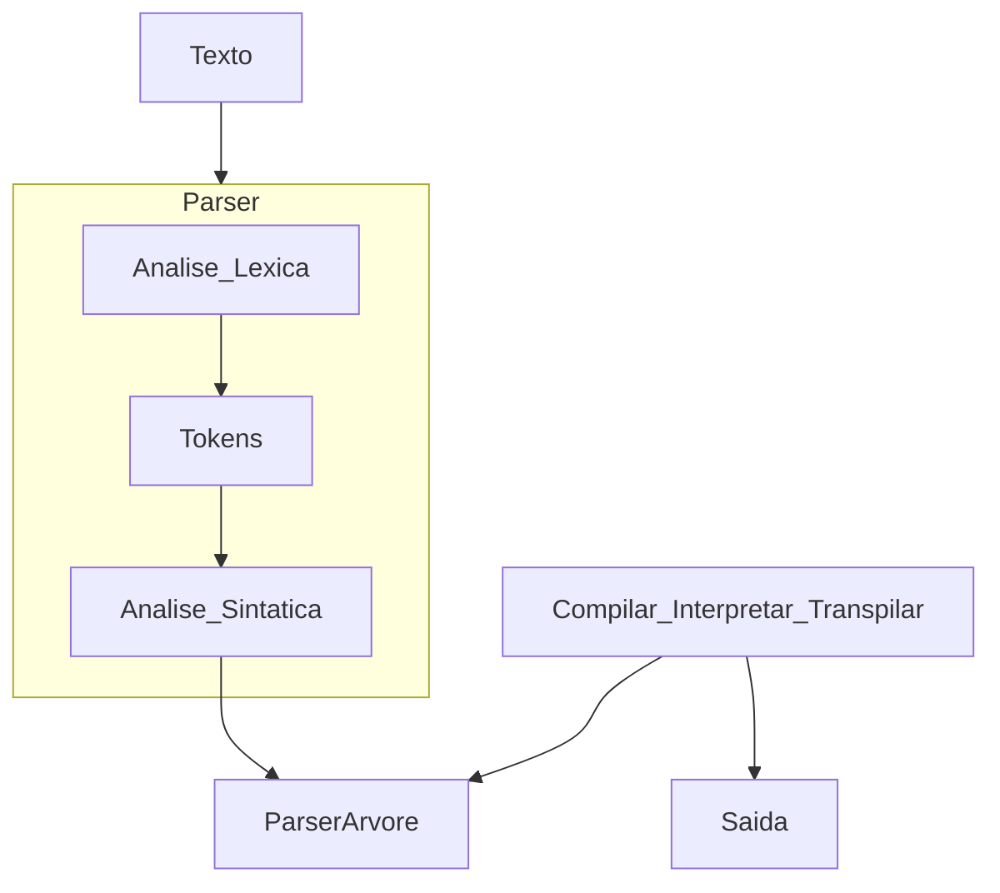

### Parser

Analisador de input (normalmente um texto) no qual retorna uma estrutura de dados (muitas vezes umas AST) ao verificar uma sintaxe correta.





#### Exemplos de parsers primitivos em TS:

```typescriptobject
type ParseError = { error: string }
type Parser<A> = (input: string) => [A | ParseError, string]

const digit = (input: string): Parser<string> => {
    if((/\d/.test(input[0]))) {
        return [input[0], input.slice(1)]
    } else {
        return [{error: "no match"}, input]
    }
}

const char = (input: string): Parser<string> => {
    if((/[A-Za-z]/.test(input[0]))) {
        return [input[0], input.slice(1)]
    } else {
        return [{error: "no match"}, input]
    }
}

```

### Parser combinators

### Abstract Syntax Tree


```ts
```
