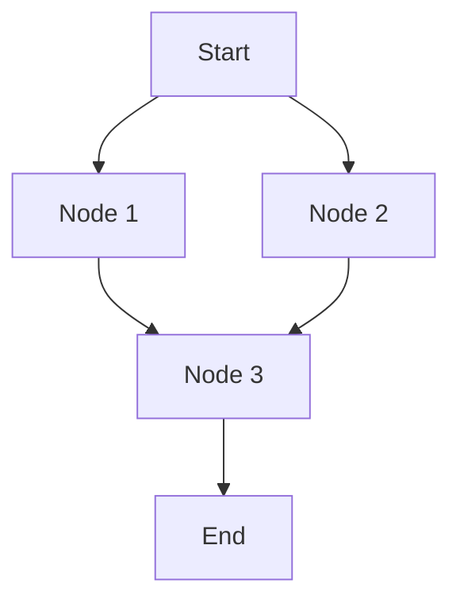

# Graph

- Depth-First Search 
- Breadth-First Search 
- Dijkstra's Algorithm

```mermaid 
graph TD
    A[Start] --> B[Node 1]
    A --> C[Node 2]
    B --> D[Node 3]
    C --> D
    D --> E[End]
```
